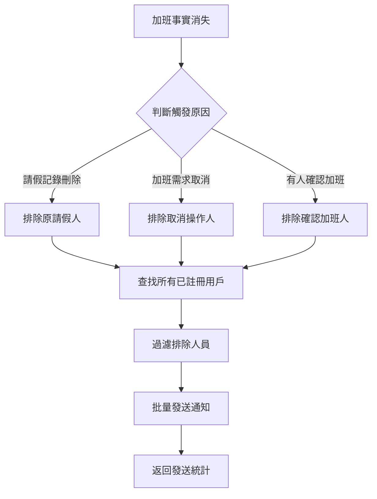

# 加班事實消失通知功能

## 📋 功能概述

當加班事實消失時，系統會自動通知所有原本可以加班的人，但**不會通知導致加班事實消失的人（X）**。

## 🎯 適用場景

### 1. 請假記錄被刪除
- **觸發條件**：管理員或請假人刪除請假記錄
- **X（排除對象）**：原請假人
- **通知對象**：所有其他已註冊的員工
- **通知內容**：「加班機會已取消 - 請假記錄已刪除」

### 2. 加班需求被取消
- **觸發條件**：請假人或管理員取消加班需求
- **X（排除對象）**：取消加班的人（通常是原請假人）
- **通知對象**：所有其他已註冊的員工
- **通知內容**：「加班機會已取消 - 加班需求已取消」

### 3. 有人確認加班
- **觸發條件**：某員工確認接受加班
- **X（排除對象）**：確認加班的人
- **通知對象**：所有其他已註冊的員工
- **通知內容**：「加班機會已取消 - XXX 已確認加班，此機會已不再開放」

## 🔧 技術實現

### 新增函數

#### 1. `sendOvertimeCancelledNotificationExcluding`
位置：`src/services/lineBot.ts`

```typescript
export async function sendOvertimeCancelledNotificationExcluding(
    cancelledOpportunity: {
        date: string;
        requesterName: string;
        requesterTeam: string;
        reason: string;
    },
    excludeNames: string[] = []
): Promise<{ success: number; failed: number; excluded: number }>
```

**功能**：
- 查找所有已註冊的 LINE 用戶
- 過濾掉需要排除的人員
- 批量發送取消通知
- 返回發送統計結果

#### 2. `sendLineOvertimeCancelledNotificationWithExclusion`
位置：`src/app/api/leave/route.ts`

```typescript
async function sendLineOvertimeCancelledNotificationWithExclusion(
    leaveRecord: any, 
    reason: string = '請假已取消',
    excludeNames: string[] = []
)
```

**功能**：
- 包裝 lineBot 服務的排除功能
- 處理請假記錄相關的通知邏輯

### 修改的 API 端點

#### 1. `/api/leave` (DELETE)
- 刪除請假記錄時排除原請假人
- 調用：`excludeNames: [recordToDelete.name]`

#### 2. `/api/leave` (PUT - clearOvertime)
- 取消加班需求時排除原請假人
- 調用：`excludeNames: [record.name]`

#### 3. `/api/leave` (PUT - confirm)
- 確認加班時排除確認加班的人
- 調用：`excludeNames: [confirmedMemberName]`

#### 4. `/api/overtime-opportunity` (DELETE)
- 新增 `excludeNames` 參數
- 支持批量排除多個人員

## 📊 通知邏輯流程



## 🧪 測試方法

### 執行測試腳本
```bash
node test-overtime-cancellation.js
```

### 測試場景
1. **請假記錄刪除測試**
2. **加班需求取消測試**
3. **加班確認通知測試**
4. **多人排除測試**

### 預期結果
- ✅ 成功通知所有符合條件的用戶
- ✅ 正確排除指定的人員
- ✅ 返回準確的統計數據

## 📝 使用範例

### 場景：張三請假，後來取消請假
```javascript
// 1. 張三請假時，系統通知其他班級有加班機會
// 2. 張三取消請假時，系統通知其他人加班機會消失，但不通知張三

await sendLineOvertimeCancelledNotificationWithExclusion(
    leaveRecord,
    '請假已取消',
    ['張三'] // 排除張三
);
```

### 場景：李四確認加班
```javascript
// 李四確認加班後，通知其他人機會已消失，但不通知李四

await sendLineOvertimeCancelledNotificationWithExclusion(
    record,
    '李四 已確認加班，此機會已不再開放',
    ['李四'] // 排除李四
);
```

## 🔍 監控與日誌

系統會記錄以下信息：
- 成功通知的用戶數量
- 失敗的通知數量
- 被排除的用戶數量
- 具體被排除的人員名單

範例日誌：
```
Line加班取消通知發送完成: {
  成功: 15,
  失敗: 0,
  排除: 1,
  排除人員: ['張三']
}
```

## ⚠️ 注意事項

1. **人員識別**：系統通過姓名來識別和排除用戶
2. **LINE ID 查找**：支援 UserProfile 和 LineUserState 兩種用戶資料來源
3. **錯誤處理**：通知失敗不會影響主要業務邏輯
4. **權限控制**：確保只有授權用戶可以觸發這些操作

## 🚀 部署注意事項

1. 確保 LINE Bot 配置正確
2. 驗證環境變數設定
3. 測試通知功能是否正常
4. 監控日誌輸出
